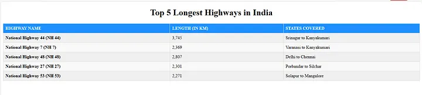

# Generative AI: Ways to Prompt for Better Productivity

Still not using Gen-AI tools like ChatGTP, Bard, DALL-E 2, Jasper, etc. to boost productivity at work/school/home in 2023 ?

This article will guide you to use the free available resources, easily and in a better, to get your desired output using the foundation Gen-AI models.

---

#### What’s Generative-AI ?

<i>Generative AI, a cutting-edge technology, can fuel productivity by automating tasks, generating creative content, and assisting with complex problem-solving. It uses a transformative technology that utilizes machine learning to produce original content, such as text, images, and music.</i>
 

#### What are Prompts ? Are they just some random simple questions ?

<i>Prompts, the instructions provided to generative AI models, serve as guiding principles, influencing the quality and relevance of the AI’s output. Effective prompting involves understanding the nuances of the AI model, the nature of the task, and the desired outcome. It entails tailoring prompts to the specific context, providing relevant examples, and guiding the AI towards the intended style or tone. By mastering the art of prompting, the productivity and efficiency of an average human will increase 10x fold.</i>

---

---

### <u>Types of Prompting</u>:
Before we move on to the useful use-cases of using the AI tools, let’s look at some of the ways to Prompt the Gen-AI models.

** <u>Note this is for Text Based Gen-AI model</u> **

#### 1. <b>Zero-shot prompting</b> — 
technique where a large language model (LLM) is asked to perform a task without being explicitly trained on it, relying on the AI’s internal knowledge and capabilities to generate meaningful outputs.

<u>

#### EXAMPLES

</u>

##### <u>EXAMPLE - 1</u>
Decide whether a Tweet's sentiment is positive, neutral, or negative.
Tweet: I loved the new YouTube video you made!
Sentiment: 

**OUTPUT :** positive

 

##### <u>EXAMPLE - 2</u>
Classify the following:
text: I saw a furry animal in the park today with a long tail and big eyes.
label: dogs, cats

**OUTPUT :** dogs

 

##### <u>EXAMPLE - 3</u>
Q: Who was President of the United States in 1955?
A:

**OUTPUT :** Dwight D. Eisenhower was the President of the United States in 1955

 

##### <u>EXAMPLE - 4</u>
write a poem on:
"cow - a wonderful animal"

**OUTPUT :** 
In fields of green, where sunlight streams,
A gentle creature, the cow, it seems.
With eyes so soft, and coat so sleek,
A pastoral charm, a sight so meek.

The cow, a symbol of nature's grace,
A creature of peace, in every space.
Her milk, a gift, so pure and white,
Nurturing life, with all her might.

Her hooves tread softly, on the verdant ground,
A gentle giant, with a soothing sound.
Her breath, a whisper, in the morning dew,
A symphony of nature, pure and true.

The cow, a friend, to man and child,
A source of comfort, in the wild.
Her presence calming, her spirit kind,
A gentle soul, in every mind.

So let us cherish, this wonderful friend,
The cow, a creature, that knows no end.
A symbol of nature, a gift so grand,
The cow, a blessing, in this earthly land.

 

<b>Zero-shot prompting</b> is a powerful technique that can be used for a variety of tasks, including:

- Answering questions
- Generating text
- Translating languages
- Writing different kinds of creative content

 

---

 

#### 2. <b>N-shot prompting</b> — 
technique that involves providing a “N” (where “N” is a natural number) examples to guide the output of a large language model (LLM).

#### <u>EXAMPLES</u>
 

##### <u>EXAMPLE - 1</u>
A "whatpu" is a small, furry animal native to Tanzania.
An example of a sentence that uses the word whatpu is:
We were traveling in Africa and we saw these very cute whatpus.
To do a "farduddle" means to jump up and down really fast.
An example of a sentence that usesthe word farduddle is:

**OUTPUT :** 
Here's an example of a sentence that uses the word "farduddle":

"The excited children farduddled around the playground, 
their laughter echoing through the air."

 

##### <u>EXAMPLE - 2</u>

This is awesome! // Negative
This is bad! // Positive
Wow that movie was rad! // Positive
What a horrible show! //

**OUTPUT :**
The given statements are sentiments that can be classified as either 
"Positive" or "Negative". Here's how they could be classified:

"This is awesome!": Positive
"This is bad!": Negative
"Wow that movie was rad!": Positive
"What a horrible show!": Negative

 

##### <u>EXAMPLE - 3</u>

Context: "Once upon a time, there was a brave knight named Sir Arthur. He 
embarked on a quest to..."
N-shot prompts:

"defeat the dragon that terrorized the kingdom."
"rescue the captured princess from the evil sorcerer."
"find the legendary sword hidden in the enchanted forest."
"uncover the truth behind the mysterious disappearance of the 
royal artifacts."
"bring peace between the warring kingdoms."

**OUTPUT :**
It seems like you've provided a context ("Once upon a time, there was 
a brave knight named Sir Arthur. He embarked on a quest to...") and 
then presented five different N-shot prompts that continue the story.

"Once upon a time, there was a brave knight named Sir Arthur. He embarked 
on a quest to defeat the dragon that terrorized the kingdom. Armed with 
his trusty sword and unwavering determination, Sir Arthur journeyed to the 
mountains where the ferocious dragon dwelled. After a fierce battle that 
shook the earth and tested Sir Arthur's courage, he emerged victorious, 
bringing peace and relief to the kingdom."

"Sir Arthur's next adventure beckoned as he set out to rescue the captured 
princess from the evil sorcerer. Venturing into the dark and forbidding 
castle, he encountered cunning traps and powerful enchantments. With his 
cleverness and bravery, Sir Arthur outwitted the sorcerer, freeing the 
princess and earning the kingdom's eternal gratitude."

"Undeterred by challenges, Sir Arthur sought the legendary sword hidden 
in the enchanted forest. The forest was shrouded in mystery and danger, 
but Sir Arthur pressed on, facing trials that tested his determination. 
Eventually, he discovered the ancient sword, its hilt shimmering with 
magical energy, granting him unparalleled strength and wisdom."

"While exploring, Sir Arthur stumbled upon clues hinting at the mysterious 
disappearance of the royal artifacts. Determined to uncover the truth, he 
embarked on a quest filled with intrigue and danger. Through his 
investigative skills, Sir Arthur unveiled a treacherous conspiracy that 
threatened the kingdom's stability, ultimately restoring honor to the 
royal family."

"In his noble quest for peace, Sir Arthur embarked on a diplomatic mission 
to bring peace between the warring kingdoms. With tact and wisdom, he 
negotiated alliances and brokered agreements that ended years of conflict, 
fostering unity and harmony among the realms."

 

<b>N-shot prompting</b> is a useful technique for tasks where it is difficult or time-consuming to provide multiple examples. For example, it can be used to:

- Translate a single sentence from one language to another
- Summarize a single paragraph of text
- Answer a single question in an informative way
- Story Generation

 

---

 

#### 3. Chain-of-thought prompting — 
technique that is used to breaks down multi-step problems into intermediate steps, allowing language models to tackle complex reasoning tasks that cannot be solved with standard prompting techniques. It encourages continuous and connected thinking.

#### <u>EXAMPLES</u>
 

##### <u>EXAMPLE - 1</u>
The odd numbers in this group add up to an even number: 
4, 8, 9, 15, 12, 2, 1.
A: Adding all the odd numbers (9, 15, 1) gives 25. The answer is False.

The odd numbers in this group add up to an even number: 
17, 10, 19, 4, 8, 12, 24.
A: Adding all the odd numbers (17, 19) gives 36. The answer is True.

The odd numbers in this group add up to an even number: 
16, 11, 14, 4, 8, 13, 24.
A: Adding all the odd numbers (11, 13) gives 24. The answer is True.

The odd numbers in this group add up to an even number: 
17, 9, 10, 12, 13, 4, 2.
A: Adding all the odd numbers (17, 9, 13) gives 39. The answer is False.

The odd numbers in this group add up to an even number: 
15, 32, 5, 13, 82, 7, 1. 
A:

**OUTPUT :<**font color="#043902">
In the provided statement, the odd numbers are 15, 5, 13, and 7.
When added together:
15 + 5 + 13 + 7 = 40
40 is an even number.
So, for the group of numbers (15, 32, 5, 13, 82, 7, 1), the answer is: True

 

##### <u>EXAMPLE - 2</u>

Q: Joe has 20 eggs. He buys 2 more cartons of eggs. Each carton contains 12
eggs. How many eggs does Joe have now? Let’s think step by step.

A: Joe started with 20 eggs. 2 cartons of 12 eggs is 24 eggs. 20 + 24 = 44.
Therefore, Joe has 44 eggs, and the answer is 44.

Q: Farmer John had 93 chickens. If he sold 20 to Farmer Bill and bought 
twice that number more, how many chickens does Farmer John have now? 
Let’s think step by step.

**OUTPUT :**
Let's break this down step by step:

1. Farmer John started with 93 chickens.
2. He sold 20 chickens to Farmer Bill.
   - After selling 20 chickens, Farmer John has:
   93 - 20 = 73 chickens remaining.
3. He bought twice the number of chickens he sold to Farmer Bill.
   - Twice the number of chickens sold (20) is 2 * 20 = 40 chickens.
4. He added the chickens he bought to his remaining chickens.
   - Adding the 40 chickens to the 73 he had left: 73 + 40 = 113 chickens.

Therefore, after selling 20 chickens to Farmer Bill and buying twice 
that number more, Farmer John has 113 chickens in total now.

 

<b>Chain-of-thought prompting</b> is a powerful technique that can be used for a variety of tasks, including:

- Problem-Solving
- Planning and Strategy
- Analytical Thinking
- Decision-Making

 

---

 

### Some Use-Cases:

#### 1. Meal Planning

##### <u>Sample Format</u>:

<i>I need [# OF MEALS] [MEAL TYPE, e.g. dinner] recipes for [# OF PEOPLE] people, total cost of the ingredients should be under [$ AMOUNT], and the recipes should take less than [#] minutes to prepare. Do not include these ingredients: [LIST OF INGREDIENTS]. Minimize the amount of [FOOD CATEGORY, e.g. carbs]. Maximize the amount of [FOOD CATEGORY, e.g. protein]. Include recipes from these cuisines: [LIST OF DESIRED CUISINES, or ask for a variety]. All recipes should use [LIST OF SPECIFIC KITCHEN TOOLS AVAILABLE, e.g. microwave or pressure cooker]. Include short cooking instructions with each recipe. Also create a shopping list with the ingredients grouped by category and the approximate cost per ingredient.</i>

<b><u>Example Prompt:</u></b>
  

I need 4 dinner recipes for 4 people, total cost of the ingredients 
should be under $80, and the recipes should take less than 30 minutes to prepare. Do not include these ingredients: red-meat, mushrooms. Minimize the amount of carbohydrates. Maximize the amount of protein and fiber. Each recipe must include protein, whole grain, and a vegetable. Each recipe should be a different type of cuisine. All recipes should use any of the following : stove, oven or instant pot. Include short cooking instructions with each recipe. Also create a shopping list with the ingredients grouped by category and the approximate cost per ingredient.

 
 

<b><u>Example Output:</u></b>

Creating four dinner recipes meeting your criteria requires a bit more detailed planning and research into specific ingredients and prices. Unfortunately, I can't access real-time data on ingredient costs or provide exact shopping lists with current prices. However, I can provide an outline of the type of recipes you might consider along with ingredient categories and approximate costs:

 

Recipe 1: Grilled Lemon Herb Chicken with Quinoa and Steamed Broccoli

Ingredients:
Chicken breasts
Quinoa
Broccoli
Lemon, herbs (like rosemary or thyme), olive oil, garlic

Cooking Instructions:
Marinate chicken in lemon juice, herbs, and olive oil. Grill until cooked.
Prepare quinoa according to package instructions.
Steam broccoli until tender.

Shopping List:
Protein: Chicken breasts
Whole Grain: Quinoa
Vegetable: Broccoli

Approximate Cost per Ingredient:
Chicken breasts: \$10
Quinoa: \$4
Broccoli: \$3
Lemon, herbs, olive oil, garlic: \$8

 
Recipe 2: Baked Lemon Garlic Tilapia with Brown Rice and Green Beans
 

 
Ingredients:
Tilapia fillets
Brown rice
Green beans
Lemon, garlic, olive oil, herbs (optional)

Cooking Instructions:
Season tilapia with lemon, garlic, and herbs. Bake until cooked.
Cook brown rice according to package instructions.
Steam or sauté green beans until tender.

Shopping List:
Protein: Tilapia fillets
Whole Grain: Brown rice
Vegetable: Green beans

Approximate Cost per Ingredient:
Tilapia fillets: \$12
Brown rice: \$3
Green beans: \$4
Lemon, garlic, olive oil, herbs: \$9

 
Recipe 3: Instant Pot Chicken and Vegetable Stir-Fry with Quinoa
 

 

Ingredients:
Chicken thighs or breasts
Quinoa
Assorted vegetables (bell peppers, carrots, snap peas, etc.)
Soy sauce, garlic, ginger

Cooking Instructions:
Sauté chicken in the Instant Pot, add vegetables, soy sauce, garlic, 
and ginger. Cook on sauté mode.
Prepare quinoa separately according to package instructions.

Shopping List:
Protein: Chicken thighs/breasts
Whole Grain: Quinoa
Vegetable: Bell peppers, carrots, snap peas, etc.

Approximate Cost per Ingredient:
Chicken thighs/breasts: \$8
Quinoa: \$4
Assorted vegetables, soy sauce, garlic, ginger: \$12

 
Recipe 4: Oven-Roasted Lemon Garlic Salmon with Cauliflower Rice 
and Asparagus
 

 

Ingredients:
Salmon fillets
Cauliflower (for cauliflower rice)
Asparagus
Lemon, garlic, olive oil, herbs (optional)

Cooking Instructions:
Season salmon with lemon, garlic, and herbs. Roast in the oven.
Prepare cauliflower rice using a food processor.
Roast or sauté asparagus until tender.

Shopping List:
Protein: Salmon fillets
Whole Grain: Cauliflower (for cauliflower rice)
Vegetable: Asparagus

Approximate Cost per Ingredient:
Salmon fillets: \$15
Cauliflower, asparagus, lemon, garlic, olive oil, herbs: \$16

 

---

#### 2. Help with writing Code

#### <b><u>Example Prompts:</u></b>
 

##### Example Prompt for Code Refactoring:

Refactor the given [language] code to improve it'ss error handling and resilience: [code block]
 

##### Example Prompt for Code Conversion:

Convert the below code snippet from [language/ framework] to
 [language/ framework]: [code snippet]
 

##### Example Prompt for Code Completion:

Complete the code [code snippet]
 

##### Example Prompt for Code Generation:

1. Generate a semantic and accessible HTML and (framework) CSS [UI component] consisting of [component parts]. The [component parts] should be [layout].
2. The database has [comma-separated table names]. Write a [database] query to fetch [requirement].

 

##### Example Prompt for Code Explanation:

Explain the following [language] snippet of code: [code block]
 

##### Example Prompt for Code Review:

Review the following [language] code for code smells, 
suggest improvements and any security vulnerabilities : [code block]

 

---

#### 3. Specify output format

#### <b><u>Example Prompt:</u></b>
 

What are the longest highways in India ? List only the top five in the form of a bullet list. Follow the below conditions:
1. Present the results as HTML.
2. Make the headings a darker blue with white lettering presented in all capitals and bold.
3. Make each data row a light gray, but vary the levels of gray so row 1 is light gray, row 2 is slightly darker, row 3 is light gray, and so on.
4. Make sure the highway name is presented in bold.
5. Make sure the columns are wide enough to accommodate the text without wrapping, left align everything, and make sure all the columns (including the headings) are perfectly aligned.

 
 
**OUTPUT :**

 
 

---
 

### Conclusion:
By mastering effective prompting strategies, individuals can harness the power of AI to unlock creativity, streamline tasks, and generate novel solutions across diverse domains. Embracing thoughtful and strategic prompting techniques opens doors to a realm of possibilities, shaping a future where human ingenuity harmoniously collaborates with AI to drive unparalleled productivity and innovation.